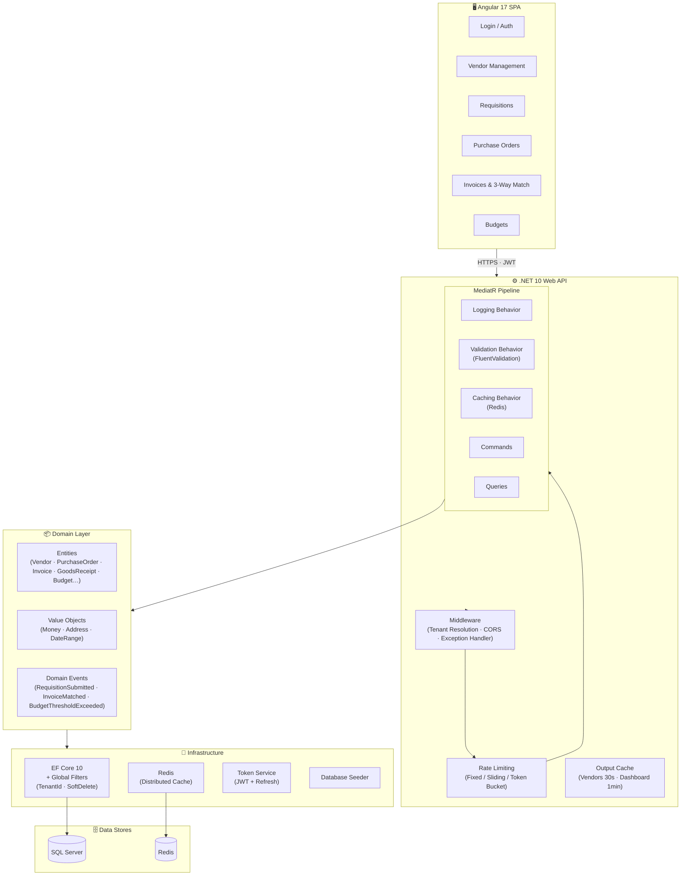
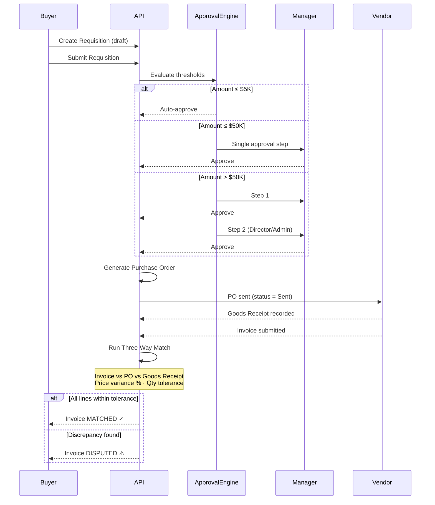
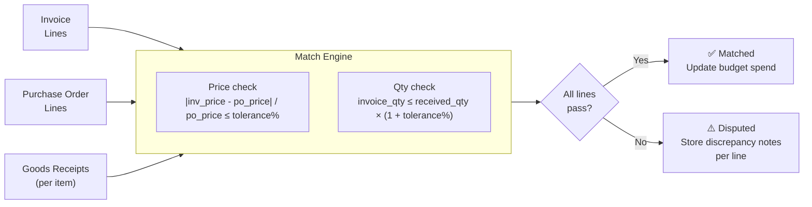
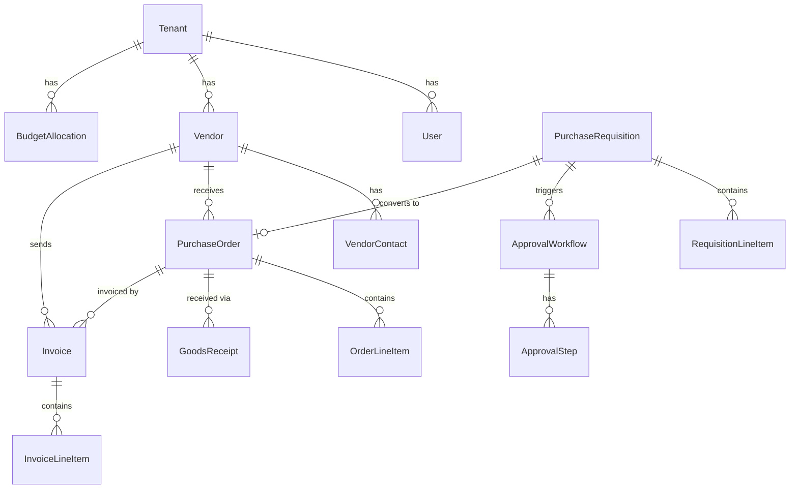

# ProVantage

**Enterprise Procurement & Vendor Management Platform**

ProVantage is a multi-tenant SaaS application that manages the full procurement lifecycle — from vendor onboarding and purchase requisitions through multi-level approvals, purchase orders, goods receipts, three-way invoice matching, and budget enforcement.

---

## Architecture



---

## How It Works — Core Flows



---

## Three-Way Match Engine



Tolerance percentages (`PriceVarianceTolerancePercent`, `QuantityVarianceTolerancePercent`) are configured per tenant.

---

## Solution Structure

```
ProVantage/
├── src/
│   ├── ProVantage.Domain/           # Entities, Value Objects, Enums, Domain Events
│   ├── ProVantage.Application/      # CQRS handlers, validators, pipeline behaviors, DTOs
│   ├── ProVantage.Infrastructure/   # EF Core, Redis, JWT, seeder, interceptors
│   └── ProVantage.API/              # Controllers, middleware, Program.cs
├── client/
│   └── provantage-ui/               # Angular 17 standalone SPA
│       └── src/app/
│           ├── core/                # Auth service, guards, interceptors
│           ├── features/            # One folder per page (login, vendors, requisitions…)
│           └── layout/              # Shell, sidebar, header
└── docker-compose.yml               # SQL Server + Redis + Seq
```

---

## Domain Model (key relationships)



---

## Tech Stack

| Layer | Technology |
|-------|-----------|
| **API Framework** | .NET 10 Web API |
| **Architecture** | Clean Architecture — Domain / Application / Infrastructure / Presentation |
| **CQRS** | MediatR with pipeline behaviors (logging, validation, Redis caching) |
| **ORM** | Entity Framework Core 10 — SQL Server, Fluent API, global query filters |
| **Validation** | FluentValidation (auto-registered, runs in MediatR pipeline) |
| **Caching** | StackExchange.Redis + ASP.NET Output Cache |
| **Rate Limiting** | ASP.NET built-in (fixed window, sliding window, token bucket) |
| **Auth** | JWT Bearer + refresh tokens, RBAC (Admin / Manager / Buyer / Viewer) |
| **Logging** | Serilog → Seq |
| **Frontend** | Angular 17 Standalone — signals, reactive forms, lazy routes |
| **Styling** | Custom SCSS design system, glassmorphism dark mode |
| **Infrastructure** | Docker Compose — SQL Server (ARM64), Redis, Seq |

---

## Key Design Decisions

**Multi-tenancy** — every entity carries `TenantId`; EF Core global query filters enforce isolation at the ORM level so no query can accidentally cross tenant boundaries.

**Result\<T\> pattern** — handlers never throw for expected failures. Every command and query returns `Result` or `Result<T>` with an `IsSuccess` flag, error message, and HTTP status code, keeping controller code uniform.

**Money value object** — monetary amounts are always paired with a currency string (`Money(amount, currency)`). Arithmetic operations (`Add`, `Subtract`, `Multiply`) enforce same-currency checks at compile time.

**Pipeline behaviors** — cross-cutting concerns (logging, validation, caching) are wired as MediatR pipeline behaviors so individual handlers stay focused on business logic only.

**Soft delete + audit** — `IsDeleted` / `DeletedAt` handled by `SoftDeleteInterceptor`; `CreatedBy` / `ModifiedBy` / timestamps by `AuditableEntityInterceptor`. Neither requires any handler code.

---

## Running Locally

**Prerequisites:** .NET 10 SDK · Node.js 20+ · Docker Desktop

```bash
# 1 — Start infrastructure
docker compose up -d

# 2 — API  (http://localhost:5000 · Swagger at /swagger)
cd src/ProVantage.API
dotnet run

# 3 — Angular SPA  (http://localhost:4200)
cd client/provantage-ui
npm install && npm start
```

---

## API Overview

| Area | Endpoints |
|------|-----------|
| Auth | `POST` login · register · refresh-token · revoke-token |
| Vendors | `GET/POST` list+create · `GET/PUT` detail+update · `PATCH` status |
| Requisitions | `GET/POST` list+create · `GET` detail · `POST` submit / approve / reject |
| Purchase Orders | `GET/POST` list+create · `GET` detail · `PATCH` status |
| Goods Receipts | `POST` record · `GET` list by PO |
| Invoices | `GET/POST` list+create · `GET` detail · `POST /{id}/match` |
| Budgets | `GET` utilization · `POST` allocate |

---

## License

MIT
